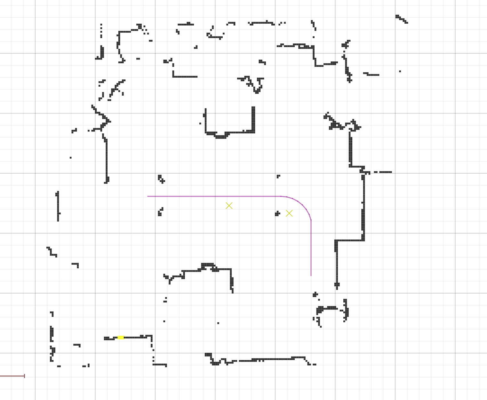
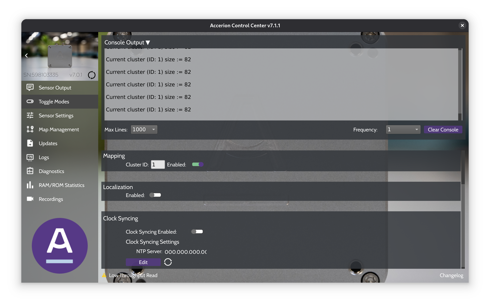

# Sick Lidar Loc

Appropriate ROS nodes are provided for Sick Lidar Loc Line Following. These nodes are provided ready to use in a Docker image. To deploy this image, please follow these commands:

```bash
cd ~ # or choose a directory that you want
git clone https://github.com/EduArt-Robotik/edu_fleet.git
cd edu_fleet/docker/sick_line_navigation_on_iot2050
docker compose up -d
```

After these commands a Docker container is running with all required ROS nodes for navigation using Sick Lidar Loc.

## Settings

The Sick Lidar Loc can be accessed [here](http://192.168.0.70). Please ensure that [this configuration](lidarloc.yml) was uploaded to the Lidar.

## Create a Map

Please see Sick Lidar Loc documentation.

## Driving

The robot follows the lines in the direction of travel when the virtual line sensors detect the path and an intersection with it is found. To start, the robot only needs to be set to autonomous mode.

## Available Qr Code

Some pre-defined QR codes (virtual, placed with Sick Mapping Tool) are available:

> **Note:** Some used parameters are configurable and are located in the respective **launch_content** folder.

| Code | Action | Description |
|------|--------|-------------|
|1. | indicate turn left | left lightings will flash yellow |
|2. | indicate turn right | right lighting will flash yellow |
|3. | default lighting | lightings will shine in default color |
|4. | police lighting | all lightings will flash in blue |
|5. | warn lighting | all lightings will flash in yellow |
|10.| disable robot | robot will be switched in mode **inactive** |
|11.| set fast velocity | robot moves with 0.5 m/s (configurable) |
|12.| set middle velocity | robot moves with 0.3 m/s (configurable) |
|13.| set slow velocity | robot moves with 0.15 m/s (configurable) |
|14.| drive forward | robot moves forward in x direction |
|15.| drive backwards | robot moves backwards in x direction |
|20.| stop for given time | robot switches in mode **inactive** for 5s (configurable) |
|30.| drive straight at next switch | When the path forks, the robot will continue straight ahead. It must go from one track to three tracks |
|31.| drive left at next switch | When path forks, the robot will continue on left track. |
|32.| drive right at next switch | When path forks, the robot will continue on right track. |
|33.| 180 degree turn | robot will turn by 180 degree |
|4X.| drive into docking station using cluster id X+1 | The robot will perform a docking maneuver with the Triton sensor. X is a placeholder for the cluster ID. The code must be placed exactly at the beginning of the docking path. For more details, please refer to the following sections.

# Docking with Triton

Docking with the Triton sensor is deployed together with the Sick Lidar Loc. Please see section [Sick Lidar Loc](#sick-lidar-loc) for further details.

Before it can be used, it is necessary to create clusters that the robot will then follow. A procedure is explained below.

## Creating Clusters

A good practice is to first create a map using the Sick Lidar Loc Tool. Then, the paths should first be created with Sick, from which the docking is then started. You can think of it as the robot branching off from the Sick path for docking and then returning to the starting position. After that, the Sick path is continued.

### Requirements:
* VMAP for Sick Lidar Loc was created.
* Paths in Sick Lidar Loc were created.
* Virtual QR codes 4X are placed at the docking starting position. The QR code must be placed direct next the path on the right side.
* Robot is localized in the map.
* Accerion Control Center is launched and connected to the Triton sensor.

### Procedure

1. To place the robot precisely at the docking start position, it is recommended to navigate the robot using Sick Lidar Loc and stop it just before the QR code. The last few centimeters should then be driven slowly using the controller until the Sick Lidar Loc web interface shows that the QR code has been read. Then stop the robot and leave it standing.



2. Now open the Accerion Control Center and go to the “Toggle Modes” tab. Disable this in the ‘Localization’ sub-item. Then, in the “Mapping” sub-item, enable mapping for the corresponding cluster ID.
Now the docking path must be traversed manually with the robot. It is recommended to do this at a slow speed. In “Console Output,” you should now see that the size of the cluster is increasing. Drive to the end of the docking path. At the end, the “Mapping” must be switched off again.



> **Note** sorry for the following step, but it is really necessary.

3. Unfortunately, after recording a cluster, the software requires several nodes to be restarted. The easiest way to do this is with the following commands on the robot:

```bash
cd edu_fleet/docker/sick_line_navigation_on_iot2050
docker compose down
docker compose up -d
```

## Driving

If the robot is on a Sick path, simply switch the robot to Autonomous mode.
